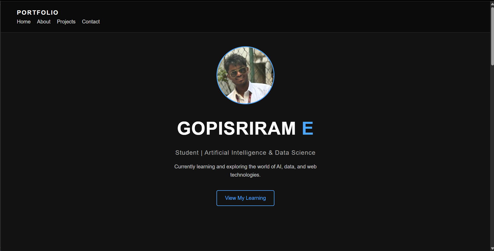
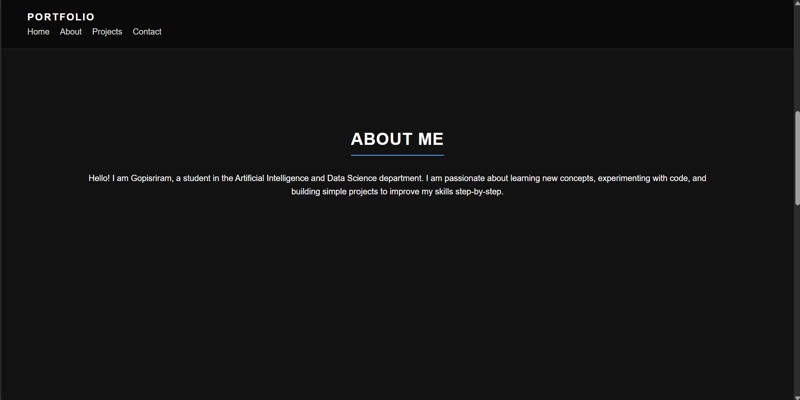
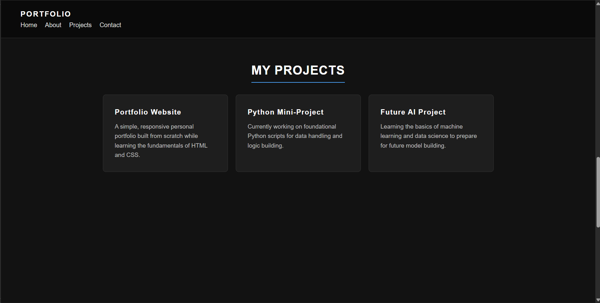
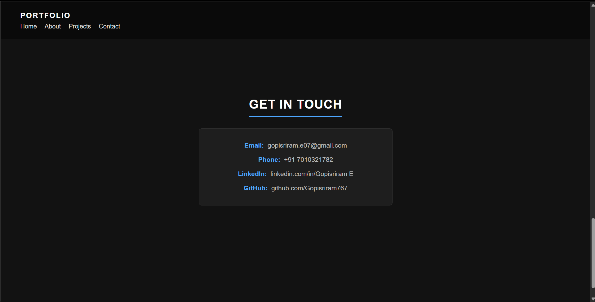

# Ex01 Portfolio
## Date:

## AIM
To create a Portfolio using HTML and CSS.

## ALGORITHM
### STEP 1
Create an HTML file (index.html)

### STEP 2
Create a CSS file (style.css)

### STEP 3
Include a navigation bar with links to different sections.

### STEP 4
Add structured sections for introduction, about, projects, and contact details.

### STEP 5
Define global styles for fonts, colors, and layout.

### STEP 6
Style the header, navigation bar, and sections.

### STEP 7
Use Flexbox or CSS Grid for layout design.

### STEP 8
Add hover effects and transitions for interactivity.

### STEP 9
Add Images and Media.

### STEP 10
Use optimized images for a professional look.

### STEP 11
Open the HTML file in a browser to check layout and functionality.

### STEP 12
Fix styling issues and refine content placement.

### STEP 13
Deploy the Portfolio.

### STEP 14
Upload to GitHub Pages for free hosting.

## PROGRAM

```
index.html

<!DOCTYPE html>
<html lang="en">
<head>
    <meta charset="UTF-8">
    <meta name="viewport" content="width=device-width, initial-scale=1.0">
    <title>Gopisriram E - Portfolio</title>
    <link rel="stylesheet" href="style.css">
</head>
<body>
    <header>
        <nav>
            <div class="logo">PORTFOLIO</div>
            <ul class="nav-links">
                <li><a href="#home">Home</a></li>
                <li><a href="#about">About</a></li>
                <li><a href="#projects">Projects</a></li>
                <li><a href="#contact">Contact</a></li>
            </ul>
        </nav>
    </header>

    <section id="home" class="hero">
        <div class="hero-content">
            <div class="photo-container">
                
            </div>
            
            <h1>GOPISRIRAM <span class="highlight">E</span></h1>
            <h3>Student | Artificial Intelligence & Data Science</h3>
            <p>Currently learning and exploring the world of AI, data, and web technologies.</p>
            <a href="#projects" class="btn">View My Learning</a>
        </div>
    </section>

    <section id="about">
        <h2>ABOUT ME</h2>
        <div class="about-content">
            <p>Hello! I am Gopisriram, a student in the Artificial Intelligence and Data Science department. I am passionate about learning new concepts, experimenting with code, and building simple projects to improve my skills step-by-step.</p>
        </div>
    </section>

    <section id="projects">
        <h2>MY PROJECTS</h2>
        <div class="project-grid">
            <div class="card">
                <h3>Portfolio Website</h3>
                <p>A simple, responsive personal portfolio built from scratch while learning the fundamentals of HTML and CSS.</p>
            </div>
            <div class="card">
                <h3>Python Mini-Project</h3>
                <p>Currently working on foundational Python scripts for data handling and logic building.</p>
            </div>
            <div class="card">
                <h3>Future AI Project</h3>
                <p>Learning the basics of machine learning and data science to prepare for future model building.</p>
            </div>
        </div>
    </section>

    <section id="contact">
        <h2>GET IN TOUCH</h2>
        
        <div class="contact-info">
            <p><strong>Email:</strong> gopisriram.e07@gmail.com</p>
            <p><strong>Phone:</strong> +91 7010321782</p>
            <p><strong>LinkedIn:</strong> linkedin.com/in/Gopisriram E</p>
            <p><strong>GitHub:</strong> github.com/Gopisriram767</p>
        </div>

    </section>

    <footer>
        <p>&copy; 2026 Gopisriram E. Student Portfolio.</p>
    </footer>
</body>
</html>

```

```
style.css

/* Global Styles */
* {
    margin: 0;
    padding: 0;
    box-sizing: border-box;
    font-family: Arial, sans-serif;
    scroll-behavior: smooth;
}

body {
    background-color: #121212; 
    color: #ffffff;
    line-height: 1.6;
}

/* Typography & Colors */
h1, h2, h3 {
    letter-spacing: 1px;
}

.highlight {
    color: #4da6ff; 
}

/* Navigation */
header {
    position: fixed;
    width: 100%;
    padding: 20px 50px;
    background: #0a0a0a;
    display: flex;
    justify-content: space-between;
    align-items: center;
    z-index: 100;
    border-bottom: 1px solid #333;
}

.logo {
    font-size: 1.2rem;
    font-weight: bold;
    letter-spacing: 2px;
}

.nav-links {
    list-style: none;
    display: flex;
    gap: 20px;
}

.nav-links a {
    color: #ddd;
    text-decoration: none;
    font-size: 1rem;
}

.nav-links a:hover {
    color: #4da6ff;
}

/* Sections - The flex-direction: column here prevents side-by-side issues */
section {
    min-height: 100vh;
    padding: 100px 10%;
    display: flex;
    flex-direction: column; 
    justify-content: center;
    align-items: center; 
    text-align: center;
}

section h2 {
    margin-bottom: 30px;
    font-size: 2rem;
    border-bottom: 2px solid #4da6ff;
    display: inline-block;
    padding-bottom: 5px;
}

/* Hero / Home Section */
.hero-content {
    display: flex;
    flex-direction: column;
    align-items: center;
    gap: 15px;
}

/* Profile Photo Styling */
.photo-container {
    width: 180px;
    height: 180px;
    border-radius: 50%; 
    overflow: hidden;
    border: 3px solid #4da6ff;
    background-color: #333; 
    margin-bottom: 15px;
}

.photo-container img {
    width: 100%;
    height: 100%;
    object-fit: cover; 
}

.hero h1 {
    font-size: 3.5rem;
}

.hero h3 {
    font-size: 1.2rem;
    color: #aaa;
    font-weight: normal;
}

.hero p {
    color: #ccc;
    max-width: 500px;
    margin-bottom: 20px;
}

.btn {
    padding: 10px 25px;
    background: transparent;
    color: #4da6ff;
    border: 2px solid #4da6ff;
    border-radius: 5px;
    text-decoration: none;
    cursor: pointer;
    transition: 0.3s;
    font-size: 1rem;
}

.btn:hover {
    background: #4da6ff;
    color: #121212;
}

/* Projects Grid */
.project-grid {
    display: grid;
    grid-template-columns: repeat(auto-fit, minmax(280px, 1fr));
    gap: 20px;
    width: 100%;
    max-width: 1000px;
}

.card {
    background: #1e1e1e;
    padding: 30px;
    border-radius: 8px;
    text-align: left;
    border: 1px solid #333;
}

.card h3 {
    margin-bottom: 10px;
    color: #fff;
}

.card p {
    color: #bbb;
    font-size: 0.95rem;
}

/* Contact Information Block */
.contact-info {
    margin-bottom: 30px; /* Pushes the form down so they don't overlap */
    color: #bbb;
    text-align: center;
    background: #1e1e1e;
    padding: 20px 40px;
    border-radius: 8px;
    border: 1px solid #333;
    width: 100%;
    max-width: 500px;
}

.contact-info p {
    margin: 10px 0;
    font-size: 1.05rem;
}

.contact-info strong {
    color: #4da6ff; 
    margin-right: 5px;
}

/* Contact Form */
.contact-form {
    display: flex;
    flex-direction: column;
    gap: 15px;
    width: 100%;
    max-width: 500px;
}

.contact-form input, .contact-form textarea {
    width: 100%;
    padding: 12px;
    background: #1e1e1e;
    border: 1px solid #444;
    border-radius: 5px;
    color: #fff;
}

footer {
    text-align: center;
    padding: 20px;
    background: #0a0a0a;
    color: #666;
}

## OUTPUT






## RESULT
The program for creating Portfolio using HTML and CSS is executed successfully.
